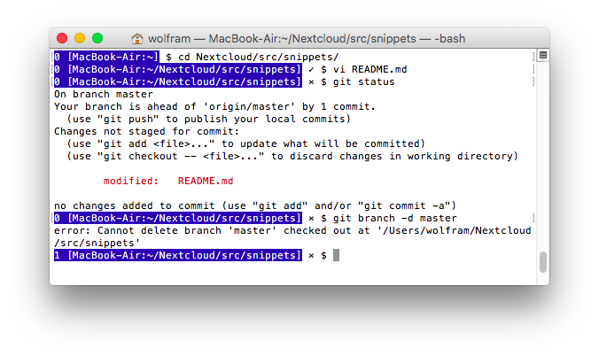

# Code Snippets

Small snippets of code that I refer to in my daily work.

## Table of Contents

* [C++](#cpp)
* [git](#git)
* [cmake](#cmake)
* [Unix/Shell](#unix)
* [vi/vim](#vi)
* [Linux](#linux)
* [macOS](#macos)
* [MySQL/MariaDB](#mysql)

## <a name="cpp"></a> C++

These assume that you are using C++14 and boost.

### Activate std::string literals

... like `auto s = "this is a std::string"s;`

```cpp
using namespace std::literals;
```

### Activate std::chrono literals

... like `auto microseconds = 1000us;`

```cpp
using namespace std::chrono_literals;
```

### Regular Expressions

std::regex reqires at least C++11. CTRE requires at least C++17.

#### Check if a string matches a regex

##### std::regex

```cpp
#include <regex>

if (std::regex_match(string,std::regex("[a-zA-Z]*"))) {
    cout << "Matches\n";
}
```

##### CTRE

```cpp
#include <ctre.hpp>
using namespace ctre::literals;

if ("[a-zA-Z]*"_ctre.match(string)) {
    cout << "Matches\n";
}
```

#### Replace a string with regex

##### std::regex

```cpp
#include <regex>

const auto result = regex_replace(str,std::regex("<"),"&lt;");
```

#### Extract matching substrings with regex

##### std::regex

```cpp
#include <regex>

const auto str = "Jul-18-2017";
std::smatch match;
if (std::regex_search(str,match,std::regex("([a-zA-Z]*)-([0-9]*)-([0-9]*)"))) {
	std::cout << "Month: " << match[1] << ", day: " << match[2] << ", year: " << match[3] << "\n";
} else {
	// No match
}
```

##### CTRE

```cpp
#include <ctre.hpp>
using namespace ctre::literals;

const auto str = "Jul-18-2017";
if (const auto match="([a-zA-Z]*)-([0-9]*)-([0-9]*)"_ctre.match(str)) {
	std::cout << "Month: " <<  match.get<1>() << ", day: " <<  match.get<2>() << ", year: " <<  match.get<3>() << "\n";
} else {
	// No match
}
```

### Split a string into lines

```cpp
#include <boost/tokenizer.hpp>
auto const tokens = boost::tokenizer<boost::char_separator<char>>(mystring,
    boost::char_separator<char>("\n"));
for (std::string const &t : tokens) {
    std::cout << t << std::endl;
}
```

### Trim white space from beginning and end of a string

```cpp
#include <boost/algorithm/string.hpp>
std::string const untrimmed = ...;
auto const trimmed = boost::trim_copy(untrimmed);
```

### Load a file into memory

```cpp
#include <fstream>
auto ifs = std::ifstream(file);
auto const data = std::string(
    std::istreambuf_iterator<char>(ifs),
    std::istreambuf_iterator<char>()
);
```

### Copy all from one stream into another

```cpp
auto in = std::istream(...);
auto out = std::ostream(...);
out << in.rdbuf();
```

### Make a long random string

```cpp
#include <fstream>
std::string longstr;
{
    auto ifs = std::ifstream("/dev/urandom",std::ios::binary);
    auto isi = std::istream_iterator<char>(ifs);
    std::copy_n(isi,
        10'000'000,
        std::insert_iterator<std::string>(longstr,longstr.begin()));
}
```

### Create all subdirectories required for a file

```cpp
#include <boost/filesystem.hpp>
boost::filesystem::create_directories(boost::filesystem::path(file).parent_path());
```

### Iterate over the files in a directory

```cpp
#include <boost/filesystem.hpp>
#include <boost/range/iterator_range.hpp>

std::string dir = ...;
for(auto const &f: boost::make_iterator_range(boost::filesystem::directory_iterator(dir))) {
    auto const file = f.path().string();
    std::cout << "Found file: " << file << std::endl;
}
```

### Get current local time as a struct tm

```cpp
#include <boost/date_time/posix_time/posix_time.hpp>
auto const tm = boost::posix_time::to_tm(boost::posix_time::second_clock::local_time());
```

### Load a URL with cpp-netlib

```cpp
auto request = boost::network::http::client::request("http://...");
request << boost::network::header("Connection","close");
auto const result = body(boost::network::http::client().get(request));
```

### Convert a file descriptor into an I/O stream

```cpp
#include <iostream>
#include <boost/iostreams/stream.hpp>
#include <boost/iostreams/device/file_descriptor.hpp>

// Output (file opened for writing)
int fd = ...;
boost::iostreams::file_descriptor_sink snk(fd,boost::iostreams::close_handle);
boost::iostreams::stream<boost::iostreams::file_descriptor_sink> os(snk);
os << "Hello World\n";

// Input (file opened for reading)
int fd = ...;
boost::iostreams::file_descriptor_source src(fd,boost::iostreams::close_handle);
boost::iostreams::stream<boost::iostreams::file_descriptor_source> is(src);
is >> myvariable;
```

### Build gcc 9 from source

It's surprisingly easy.

```sh
$ cd
$ mkdir gcc
$ cd gcc
$ wget ftp://ftp.fu-berlin.de/unix/languages/gcc/releases/gcc-9.1.0/gcc-9.1.0.tar.gz
$ tar xzf gcc-9.1.0.tar.gz
$ cd gcc-9.1.0
$ contrib/download_prerequisites

$ cd ~/gcc
$ mkdir build
$ cd build
$ ../gcc-9.1.0/configure --prefix=$HOME/gcc/install --disable-multilib
$ make
$ make install

$ ~/gcc/install/bin/g++ --version
g++ (GCC) 9.1.0

$ sudo update-alternatives --install /usr/bin/gcc gcc $HOME/gcc/install/bin/gcc 60 --slave /usr/bin/g++ g++ $HOME/gcc/install/bin/g++
$ sudo update-alternatives --config gcc
$ gcc --version
gcc (GCC) 9.1.0
$ g++ --version
g++ (GCC) 9.1.0
```

## <a name="git"></a> git

### Create the “git godlog” command

```sh
git config --global alias.godlog "log --graph --oneline --decorate"
```

### Manage Libre Office files in git

Requires git 1.6.1 or later.

Install the "Open Document To Text" tool:

```
Linux
$ sudo apt install odt2txt

Mac
$ brew install odt2txt
```

Add the following to `~/.gitconfig`:

```
[diff "odf"]
      textconv=odt2txt
[diff "odp"]
      textconv=odp2txt
[diff "ods"]
      textconv=ods2txt
```

Add the following to the `.gitattributes` file in the project root:

```
*.odp diff=odp
*.ods diff=ods
*.odt diff=odt
```

If `git diff` displays the following error:

```
Error: Unable to connect or start own listener. Aborting.
fatal: unable to read files to diff
```

then type `unoconv -l` and retry.

More information:

* http://www-verimag.imag.fr/~moy/opendocument/
* https://git-scm.com/book/en/v2/Customizing-Git-Git-Attributes ("Diffing Binary Files" section)

### Put git version number into PDF

... that is created from a Libre Office document which is managed in git as described in the previous section, using the tag-based version number generated by `git describe`. Tested with Libre Office 5 in Linux.

Preparation (once per document):

1. Open the document in LibreOffice Writer
1. Move cursor to where the version number is to be displayed
1. Insert → Field → More fields ...
1. Variables → Set variable, Name: version, Value: 0.0, Format: Text, Insert, Close
1. To show the version number elsewhere:  Insert → Field → More fields ... → Variables → Show variable, version, Insert, Close
1. Close and save the document
1. Add/commit the document to git

To convert the document into a PDF, replacing the "0.0" placeholder by the current git version number:

```sh
$ odt2pdf -o myname.pdf -F version=$(git describe --dirty --always) filename.odt
```

About tag-based git version numbers: https://git-scm.com/docs/git-describe

## <a name="cmake"></a> cmake

### Activate C++14

... and be as portable as possible by switching off stuff like GNU language extensions.

```cmake
set(CMAKE_CXX_STANDARD 14)
set(CMAKE_CXX_EXTENSIONS OFF)
```

### Link with the pthreads library

```cmake
cmake_minimum_required (VERSION 3.5)
project (myproject CXX)
find_package (Threads REQUIRED)
add_executable (myproject ...)
target_link_libraries (myproject Threads::Threads)
```

More: https://stackoverflow.com/questions/1620918/cmake-and-libpthread

### Same output directory for all sub-projects

```cmake
set (EXECUTABLE_OUTPUT_PATH "${CMAKE_SOURCE_DIR}/build")
```

### Use compiler cache (ccache)

```cmake
find_program (CCACHE_FOUND ccache)
if (CCACHE_FOUND)
    set_property(GLOBAL PROPERTY RULE_LAUNCH_COMPILE ccache)
endif (CCACHE_FOUND)
```

## <a name="unix"></a> Unix/Shell

Where "Shell" means bash, or something sufficiently compatible.

### Shell Prompt And Git Status

Show the last command's exit status in the shell prompt, and show the prompt with a dark background to make it stand out better. When in a git repository, show the current git status: a cross if something needs to be committed, an up arrow if something needs to be pushed, a down arrow when something can be pulled, three stacked horizontal lines if there's a shash, a check mark if everything is clean.

Put the following into your `.profile` or `.bashrc`.

```sh
gitstatus() {
    if [ "$1" = "--color" ];then
        local RED=$(tput setaf 1)
        local BLU=$(tput setaf 6)
        local GRN=$(tput setaf 2)
        local OFF=$(tput sgr0)
    else
        local RED=""
        local BLU=""
        local GRN=""
        local OFF=""
    fi

    local S
    S=$(LANG=C git status -sb --porcelain 2>/dev/null) || return
    if [[ $S =~ [[:cntrl:]][^#] ]];then
        echo "${RED}×${OFF} "
    elif [[ $S =~ ^##.*\[behind ]];then
        echo "${BLU}↓${OFF} "
    elif [[ $S =~ ^##.*\[ahead ]];then
        echo "${BLU}↑${OFF} "
    elif git stash list | grep -q .;then
        echo "${BLU}≡${BLU} "
    else
        echo "${GRN}✓${OFF} "
    fi
}

gits() {
    local G
    find ${*:-.} -type d -name .git 2>/dev/null \
    | while read G;do
        local D=$(dirname "$G")
        (cd "$D" >/dev/null && git remote update &>/dev/null && echo "$(gitstatus --color)$D")
    done
}

PS1BEFORE=$(tput sgr0)$(tput rev)$(tput setaf 4)
PS1AFTER=$(tput sgr0)
PS1='\[$PS1BEFORE\]$? [\h:\w]\[$PS1AFTER\] $(gitstatus)\$ '
```



This also defines the `gits` command which recursively searches the current directory (or directories you specify on the command line) for git repositories and displays their status (cross, up/down arrow, check mark as described above).

```
$ gits
↑ ./afl-demo
✓ ./cloud-backup
✓ ./cmake-hello-world
✓ ./ecs
↑ ./helloworld
✓ ./itunes-in-nextcloud
× ./snippets
↓ ./ThreadPool
✓ ./version
```

### Host Name And Work Directory In Terminal Window Title

```sh
PS1="\[\e]0;\h:\w\a\]$PS1"
```

### Unlimited History

```sh
export HISTFILE="$HOME/.bash-history"
export HISTFILESIZE=
export HISTSIZE=
```

Changing the history file name from the default .bash_history to something else (here, by using a dash instead of an underscore, but could be anything) prevents non-login shells (that use the default history size) from deleting our history.

### Convert To/From time_t

Requires gawk (the Gnu implementation of awk, e. g. as Linux has it).

```sh
$ gawk 'BEGIN {print systime()}'
1497429720

$ gawk 'BEGIN {print mktime("2017 06 14 10 42 00")}'
1497429720

$ gawk 'BEGIN {print strftime("%F %T %Z",1497429720)}'
2017-06-14 10:42:00 CEST

$ gawk 'BEGIN {print strftime("%F %T %Z",1497429720,1)}'
2017-06-14 08:42:00 GMT
```

### Asymmetric Encryption

Make key pair:

```sh
$ openssl req -newkey rsa:2048 -new -nodes -x509 -days 36500 -out cert.pem -keyout key.pem
```

`cert.pem` is the certificate file (public key), used for encryption. `key.pem` is the private key file, used for decryption.

Encrypt:

```sh
$ openssl smime -encrypt -aes256 -binary -outform DER cert.pem <cleartext.dat  >ciphertext.dat
```

Decrypt:

```
$ openssl smime -decrypt -inform DER -inkey key.pem <ciphertext.dat >cleartext.dat
```

Show contents of a pem file:

```
$ openssl x509 -in filename.pem -text
```

### Extract Pages From PDF File

Replace 11 and 22 with the range of pages you want to extract.

With pdftk:

```sh
$ pdftk your-input-file.pdf cat 11-22 output your-output-file.pdf
```

pdftk can extract arbitrary collections of pages (e. g., use `cat 1 3-5 8` to extract pages 1, 3, 4, 5, and 8).

With Ghostscript:

```sh
$ gs -sDEVICE=pdfwrite -dNOPAUSE -dBATCH -dSAFER \
	-dFirstPage=11 \
	-dLastPage=22 \
	-sOutputFile=your-output-file.pdf \
	your-input-file.pdf
```

## <a name="vi"></a> vi/vim

### Convert line endings from DOS to Unix

```
:set ff=unix
```

## <a name="linux"></a> Linux

### Disable pager in systemctl

which is annoying as hell and completely different from the way Unix programs classically work.

In shell profile:

```sh
export SYSTEMD_PAGER=cat
```

Then:

```sh
$ sudo visudo
```

Add the following line in the "Defaults" section:

```sh
Defaults        env_keep += "SYSTEMD_PAGER"
```

More info: https://unix.stackexchange.com/questions/343168/can-i-prevent-service-foo-status-from-paging-its-output-through-less

### Natural Scrolling

Make your mouse wheel work like on a Mac: Roll up to scroll up, roll down to scroll down.

Put the following into /usr/share/X11/xorg.conf.d/20-natural-scrolling.conf, then reboot:

```
Section "InputClass"
        Identifier "Natural Scrolling"
        MatchIsPointer "on"
        MatchDevicePath "/dev/input/event*"
        Option "VertScrollDelta" "-1"
        Option "HorizScrollDelta" "-1"
        Option "DialDelta" "-1"
EndSection
```

If this doesn't work, try:

```sh
$ xinput set-prop 9 275 1
```

`9` and `275` are just examples, find the actual values as follows.

First, the `9` is the `id` of your mouse device, to be found like this:

```sh
$ xinput list
⎡ Virtual core pointer                    	id=2	[master pointer  (3)]
⎜   ↳ Virtual core XTEST pointer              	id=4	[slave  pointer  (2)]
⎜   ↳ Logitech USB-PS/2 Optical Mouse         	id=9	[slave  pointer  (2)]
⎣ Virtual core keyboard                   	id=3	[master keyboard (2)]
    ↳ Virtual core XTEST keyboard             	id=5	[slave  keyboard (3)]
    ↳ Power Button                            	id=6	[slave  keyboard (3)]
    ↳ Video Bus                               	id=7	[slave  keyboard (3)]
    ↳ Power Button                            	id=8	[slave  keyboard (3)]
    ↳ Eee PC WMI hotkeys                      	id=10	[slave  keyboard (3)]
    ↳ AT Translated Set 2 keyboard            	id=11	[slave  keyboard (3)]
```

Once you got the `9`, find the `275` like this:

```sh
$ xinput list-props 9 | grep -i natural
	libinput Natural Scrolling Enabled (275):	0
	libinput Natural Scrolling Enabled Default (276):	0
```

Sources:

* https://wiki.archlinux.org/index.php/Libinput#Natural_scrolling
* https://kofler.info/natural-scrolling-mit-dem-mausrad/#more-1956

### Show System Messages During Boot/Shutdown

Make your machine start up and shut down like a real computer.

In `/etc/default/grub`, remove `quiet splash` from `GRUB_CMDLINE_LINUX_DEFAULT`, so it's

```
GRUB_CMDLINE_LINUX_DEFAULT=""
```

Uncomment `GRUB_GFXMODE` and set it to one one more resolutions supported by your monitor, followed by `auto`, for example

```
GRUB_GFXMODE="1920x1080,640x480,auto"
```

Then:

```sh
$ sudo update-grub
```

Reboot and enjoy.

Sources:

* https://askubuntu.com/questions/25022/how-to-enable-boot-messages-to-be-printed-on-screen-during-boot-up
* http://www.subdude-site.com/WebPages_Local/RefInfo/Computer/Linux/BootMessages_andGrub2/BootMessages_andGrub2.htm
* https://askubuntu.com/questions/103516/grub2-use-maximum-detected-resolution#142332
* https://www.gnu.org/software/grub/manual/grub/html_node/gfxmode.html

### Mount Nextcloud

Access the files in your Nextcloud without syncing them to your harddisk, using Nextcloud's WebDAV interface. Doesn't require disk space to store your Nextcloud files locally. Doesn't use the Nextcloud client software.

Tested with Ubuntu 16.04. Will probably work with Owncloud or any other WebDAV-based file service.

The following examples assume that

* `mycloud.example.com` is your Nextcloud server
* `myname` is your Nextcloud user name
* `mypassword`is your Nextcloud password

Preparation:

```sh
$ sudo apt install ca-certificates
$ sudo apt install davfs2
$ sudo mkdir /mnt/myname
$ sudo usermod -aG davfs2 $USER
```

Add the following line to `/etc/fstab`:

```
https://mycloud.example.com/remote.php/webdav /mnt/myname davfs user,noauto 0 0
```

If you want read-only access (you can read your cloud files but not change them):

```
https://mycloud.example.com/remote.php/webdav /mnt/myname davfs user,noauto,ro,dir_mode=555,file_mode=444 0 0
```

Add the following to `/etc/davfs2/secrets`:

```
/mnt/myname myname mypassword
```

Note: Every user on your Linux machine can mount your Nextcloud files, which may or may not be desired.

Finally, to mount your Nextcloud files:

```sh
$ sudo mount /mnt/myname
```

More information: https://wiki.ubuntuusers.de/WebDAV/

Using it to back up your Nextcloud: https://gitlab.com/wolframroesler/back-up-nextcloud

### Screen Recording

```sh
$ sudo add-apt-repository ppa:maarten-baert/simplescreenrecorder
$ sudo apt-get update
$ sudo apt-get install simplescreenrecorder
```

More: http://www.maartenbaert.be/simplescreenrecorder/

## <a name="macos"></a> macOS

### Eject CD/DVD

```sh
$ drutil tray eject
```

### Don't Create .DS_Store Files

```sh
$ defaults write com.apple.desktopservices DSDontWriteNetworkStores true
```

Log off or reboot to activate.

### Install Package Manager

To install software like a boss.

```sh
$ /usr/bin/ruby -e "$(curl -fsSL https://raw.githubusercontent.com/Homebrew/install/master/install)"
$ brew analytics off
```

More information: http://brew.sh

You may like:

```sh
$ brew install htop
$ brew install tree
```

### Install boost

To use the boost C++ libraries. Requires the `brew` package manager desribed above.

```sh
$ brew install boost
$ ln -s /usr/local/Cellar/boost/1.67.0_1/ /usr/local/boost
```

And update the symlink whenever a new boost version comes out. Why don't they install in `/usr/local/boost` directly like everyone else, or at least create the symlink automatically?

If you need to build different projects with different boost versions you can leave the symlink away and use an environment variable instead:

```sh
$ export BOOST_ROOT=/usr/local/Cellar/boost/1.67.0_1/
```

## <a name="mysql"></a> MySQL/MariaDB

### SQL Profiling

```sql
set profiling=1;
select ...;
show profile;
```

### Show Explain Plan

```sql
explain select ...;
```

### Hang the database

Useful in test cases, e. g. when testing where clauses constructed from user input. Causes a lot of load in the database that makes the application hang, hogs one more more CPUs, prevents new clients from connecting, and might require a DB bounce.

```sql
SELECT something
FROM somewhere
WHERE BENCHMARK(100000000000,ENCODE('a','b'))='c';
```

---
*Wolfram Rösler • wolfram@roesler-ac.de • https://gitlab.com/wolframroesler • https://twitter.com/wolframroesler • https://www.linkedin.com/in/wolframroesler/*
